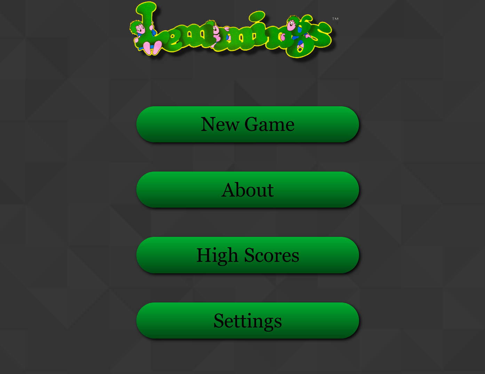
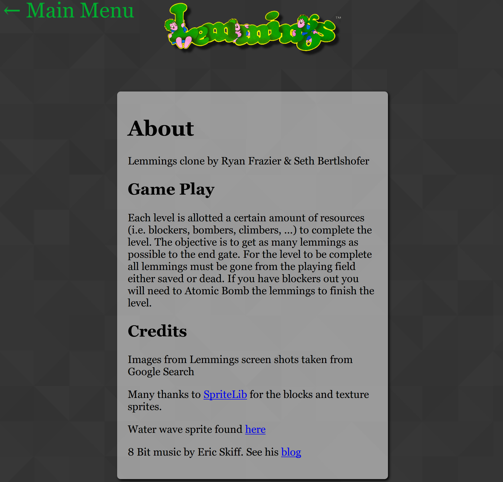
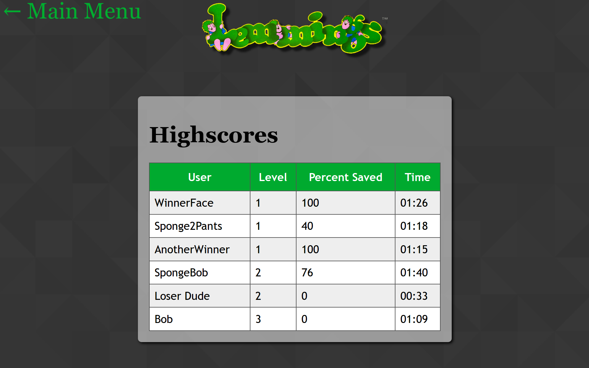
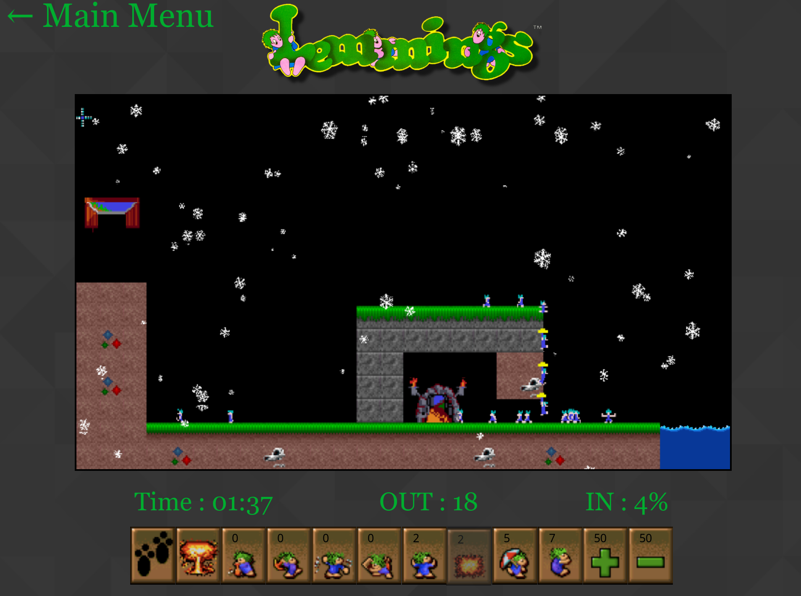

# Lemmings Clone

A Lemmings clone using HTML5 and Javascript

View a demo [here](https://youtu.be/knKsHbLo6Yc).

To try it out locally with docker-compose:

```
cd ./server
docker-compose up
```

This sets up a mongo database for you.

# Contributors
 - Ryan Frazier [pianomanfrazier](https://github.com/pianomanfrazier)
 - Seth Bertlshofer [ironLink21](https://github.com/ironlink21)

# Libraries Used

- [Express](https://expressjs.com)
- [Handlebars](handlebars.js) frontend templates
- Sass
- [Papaparse](papaparse.com) for parsing csv level maps (edit level maps in excel and export to csv).
- [Page.js](https://visionmedia.github.io/page.js/) for front end routing
- [Mongoose](mongoosejs.com) for Mongo ORM

# Configuration

The level maps are found in `server/public/levels`. The corresponding lemming resources (*i.e.* number of lemmings, bombers, umbrella, ...) is found in `client/js/config.js`. Placing meta-data in the csv was difficult to parse so it is separate for now.

## TODO:

Allow user to upload user maps and meta data for level.


# External Dependencies

The Node server needs a MongoDB to connect to save scores and users. The game will work just fine without the database though.

- MonogDB -- start a docker instance with `docker run --name lemmings-mongo -p 27017:27017 -d mongo`
- sass -- must be in your executable path in order to compile the sass to css


# run project for development

- install all node_modules (we use yarn `yarn` at project root)
- go to server/ run `nodemon`. Install nodemon with `npm install -g nodemon`.
- open a new terminal, go to project root and run `gulp`
- open your browser to `localhost:3001` (if it automatially opens your browser manually refresh the page once to make sure everything is loaded)

# Screenshots







